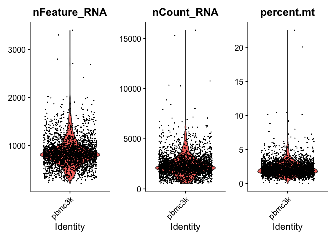
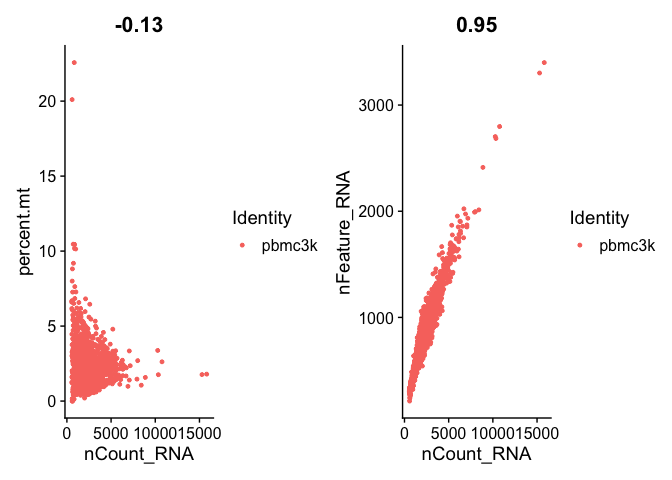
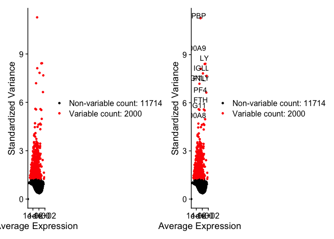

Seurat_practice
================
2025-06-09

Load packages

``` r
library(dplyr)
```

    ## 
    ## Attaching package: 'dplyr'

    ## The following objects are masked from 'package:stats':
    ## 
    ##     filter, lag

    ## The following objects are masked from 'package:base':
    ## 
    ##     intersect, setdiff, setequal, union

``` r
library(Seurat)
```

    ## Loading required package: SeuratObject

    ## Loading required package: sp

    ## 
    ## Attaching package: 'SeuratObject'

    ## The following objects are masked from 'package:base':
    ## 
    ##     intersect, t

``` r
library(patchwork)
```

Load data

``` r
# Load the PBMC dataset
pbmc.data <- 
  Read10X(data.dir = "data/filtered_gene_bc_matrices/hg19/")

# Initialize the Seurat object with the raw (non-normalized data).
pbmc <- 
  CreateSeuratObject(counts = pbmc.data,
                     project = "pbmc3k",
                     min.cells = 3,
                     min.features = 200)
```

    ## Warning: Feature names cannot have underscores ('_'), replacing with dashes
    ## ('-')

``` r
pbmc
```

    ## An object of class Seurat 
    ## 13714 features across 2700 samples within 1 assay 
    ## Active assay: RNA (13714 features, 0 variable features)
    ##  1 layer present: counts

Looking at the count matrix

``` r
pbmc.data[c("CD3D", "TCL1A", "MS4A1"), 1:30]
```

    ## 3 x 30 sparse Matrix of class "dgCMatrix"

    ##   [[ suppressing 30 column names 'AAACATACAACCAC-1', 'AAACATTGAGCTAC-1', 'AAACATTGATCAGC-1' ... ]]

    ##                                                                    
    ## CD3D  4 . 10 . . 1 2 3 1 . . 2 7 1 . . 1 3 . 2  3 . . . . . 3 4 1 5
    ## TCL1A . .  . . . . . . 1 . . . . . . . . . . .  . 1 . . . . . . . .
    ## MS4A1 . 6  . . . . . . 1 1 1 . . . . . . . . . 36 1 2 . . 2 . . . .

Check size of object

``` r
dense.size <- object.size(as.matrix(pbmc.data))
dense.size
```

    ## 709591472 bytes

``` r
sparse.size <- object.size(pbmc.data)
sparse.size
```

    ## 29905192 bytes

``` r
dense.size/sparse.size
```

    ## 23.7 bytes

# Quaility Control

``` r
# The [[ operator can add columns to object metadata. This is a great place to stash QC stats
pbmc[["percent.mt"]] <- PercentageFeatureSet(pbmc, pattern = "^MT-")
```

Visualise QC using vioine plots

``` r
# Visualize QC metrics as a violin plot
VlnPlot(pbmc,
        features = c("nFeature_RNA",
                     "nCount_RNA",
                     "percent.mt"),
        ncol = 3)
```

    ## Warning: Default search for "data" layer in "RNA" assay yielded no results;
    ## utilizing "counts" layer instead.

<!-- -->

``` r
# FeatureScatter is typically used to visualize feature-feature relationships, but can be used
# for anything calculated by the object, i.e. columns in object metadata, PC scores etc.

plot1 <- FeatureScatter(pbmc, feature1 = "nCount_RNA", feature2 = "percent.mt")
plot2 <- FeatureScatter(pbmc, feature1 = "nCount_RNA", feature2 = "nFeature_RNA")
plot1 + plot2
```

<!-- -->

``` r
pbmc <- subset(pbmc,
               subset = nFeature_RNA > 200 & 
                 nFeature_RNA < 2500 & 
                 percent.mt < 5)
```

# Normalising Data

``` r
pbmc <- NormalizeData(pbmc,
                      normalization.method = "LogNormalize",
                      scale.factor = 10000)
```

    ## Normalizing layer: counts

``` r
pbmc <- NormalizeData(pbmc)
```

    ## Normalizing layer: counts

# feature selection

``` r
pbmc <- FindVariableFeatures(pbmc, selection.method = "vst", nfeatures = 2000)
```

    ## Finding variable features for layer counts

``` r
# Identify the 10 most highly variable genes
top10 <- head(VariableFeatures(pbmc), 10)

# plot variable features with and without labels
plot1 <- VariableFeaturePlot(pbmc)
plot2 <- LabelPoints(plot = plot1, points = top10, repel = TRUE)
```

    ## When using repel, set xnudge and ynudge to 0 for optimal results

``` r
plot1 + plot2
```

    ## Warning in scale_x_log10(): log-10 transformation introduced infinite values.
    ## log-10 transformation introduced infinite values.

<!-- -->
